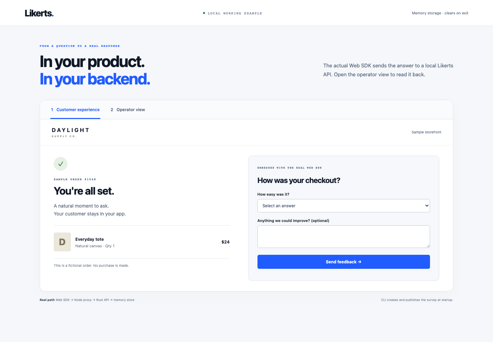

# Likerts

Likerts is a free, open-source backend for surveys embedded in your own web and mobile products. It provides one typed platform through HTTP, MCP and a Rust CLI, with SDKs for Web, React Native, iOS, Android and Flutter.

[Download the community release](https://github.com/crosstabs/likerts/releases/tag/community-v0.1.0) · [Installation guide](docs/releases.md) · [Contribute](CONTRIBUTING.md)

Likerts does not host respondent links or send invitations. Your application decides when a survey appears and supplies the customer context. Likerts validates the published schema, stores the response, returns an idempotent receipt and makes the data available through scoped reads, exports and signed callbacks.

There are no response credits, paid plans, license keys or application-level response quotas. Accepted-response counts are observability data only. Operators still configure request rates, payload bounds, storage capacity and concurrency to protect their infrastructure.

## What is included

- Nine question types: single choice, multiple choice, scale, text, number, date, ranking, matrix and constant sum
- NPS and yes/no presets, conditional visibility, pages and branching
- Immutable published survey versions and collection credentials
- PostgreSQL row-level security for workspace isolation
- Scoped service credentials and OAuth grants
- Stable response pagination, bounded exports, retention and erasure
- Signed response webhooks
- API, MCP and CLI operation parity
- Five client SDKs with encrypted offline queue adapters

## Try a real embedded survey

Clone the repository, then run:

```bash
git clone https://github.com/crosstabs/likerts.git
cd likerts
bash scripts/run-feedback-demo.sh
```

Open `http://127.0.0.1:4310`. Answer the survey, then retrieve the matching response and metadata in the operator view. The example uses the real Web SDK, Rust API and CLI. It requires Rust stable, Node.js 22+ and Bash; temporary memory storage clears when you stop it.

[](https://likerts.com/media/embedded-feedback-demo.webm)

[Watch the 40-second walkthrough](https://likerts.com/media/embedded-feedback-demo.webm) · [Example source and instructions](examples/embedded-feedback/README.md) · [Versioned downloads and installation](docs/releases.md)

## Install in your application

```bash
npm install @likerts/web
# For a React Native application:
npm install @likerts/react-native
# For a local MCP client:
npm install --global @likerts/mcp
```

These are client packages; connect them to your Likerts API using the [SDK guides](sdks/) or [MCP setup](tools/README.md#mcp-for-local-agent-clients). The [Next.js App Router example](examples/nextjs-feedback/README.md) demonstrates explicit mounting, navigation cleanup and safe retry of an ambiguous submission. See the [installation guide](docs/releases.md#install-from-npm) for versions, compatibility and native SDK source.

## Run with durable local storage

With Docker Compose and OpenSSL installed:

```bash
bash infrastructure/local/compose.sh up --build --detach --wait
curl --fail http://127.0.0.1:8080/health
```

The [local guide](infrastructure/local/README.md) takes you through your first stored response, stop/restart and explicit reset. For an automated clean-consumer rehearsal using the published CLI and Web SDK, run `node scripts/check-newcomer.mjs`; see [prerequisites and verification boundaries](docs/verification/newcomer.md). The API binds only to loopback and PostgreSQL data survives container recreation. This setup uses development authentication; follow the [self-host operations guide](docs/SELF-HOSTING.md) before any public deployment.

## Run the API locally

You need Git, Rust stable, Node.js 22+, Bash and `jq`. The memory store is intended for a disposable local loop; PostgreSQL is required for durable deployments.

```bash
git clone https://github.com/crosstabs/likerts.git
cd likerts
source scripts/dev-env.sh
export LIKERTS_DEV_TOKENS='{"local-demo-management-token":"demo"}'
export LIKERTS_ALLOW_MEMORY=1
export LIKERTS_ADMISSION_MODE=disabled
cargo run --manifest-path backend/Cargo.toml --locked
```

The API listens on `http://127.0.0.1:8080`. In another terminal:

```bash
source scripts/dev-env.sh
export LIKERTS_API_URL=http://127.0.0.1:8080
export LIKERTS_TOKEN=local-demo-management-token
cargo run --manifest-path tools/cli/Cargo.toml --locked -- capabilities
bash scripts/first-response.sh
```

The script creates and publishes a survey, creates a collection, submits one response twice with the same idempotency key, verifies one stored response, and prints the receipt. The [capability reference](contracts/CAPABILITIES.md) documents every API, MCP and CLI operation. [Tool setup](tools/README.md) covers the CLI and MCP server.

For PostgreSQL, set `DATABASE_URL` and use a migration-capable local account with `LIKERTS_RUN_MIGRATIONS=1`. Production should run migrations separately and connect the API with the restricted runtime role in `backend/provision-runtime.sql`.

## Verify

```bash
bash scripts/check.sh
bash scripts/check-postgres.sh
bash scripts/check-all-sdks.sh
```

The checks cover domain validation, interface parity, tenant isolation, durable idempotency, response lifecycle and all five SDK implementations.

## Repository map

| Directory | Responsibility |
| --- | --- |
| `backend/` | Rust API, domain validation, PostgreSQL repositories and migrations |
| `contracts/` | OpenAPI, survey schemas and cross-platform fixtures |
| `tools/mcp/` | Typed MCP adapter |
| `tools/cli/` | Rust CLI |
| `sdks/` | Web, React Native, iOS, Android and Flutter SDKs |
| `control-plane/` | Public site, documentation and optional hosted workspace UI |
| `infrastructure/` | Render, recovery, export and webhook deployment assets |

## Security model

A collection credential can fetch one immutable collection and submit responses to it. Management credentials are workspace-bound and explicitly scoped. PostgreSQL row-level security enforces tenant boundaries beneath the application layer. Browser origins are policy controls and do not replace authentication.

Never put a management credential in a browser or mobile app. Treat metadata as untrusted input and avoid sending secrets or unnecessary personal data. See [SECURITY.md](SECURITY.md) for reporting and deployment guidance.

## License

Likerts is available under the [MIT License](LICENSE).

## Contribute

Start with the [contribution guide](CONTRIBUTING.md) and [community roadmap](docs/community/ROADMAP.md). Pick a [good first issue](https://github.com/crosstabs/likerts/issues?q=is%3Aissue%20is%3Aopen%20label%3A%22good%20first%20issue%22), explore [help wanted tasks](https://github.com/crosstabs/likerts/issues?q=is%3Aissue%20is%3Aopen%20label%3A%22help%20wanted%22), or describe your integration in [Discussions](https://github.com/crosstabs/likerts/discussions).

Bug reports, documentation fixes and reproducible integration examples are useful contributions. Each area has focused checks so you can contribute without installing every mobile toolchain. See our [code of conduct](CODE_OF_CONDUCT.md) and [maintainer process](docs/community/MAINTAINERS.md). For setup problems, see [support and troubleshooting](docs/community/SUPPORT.md).
