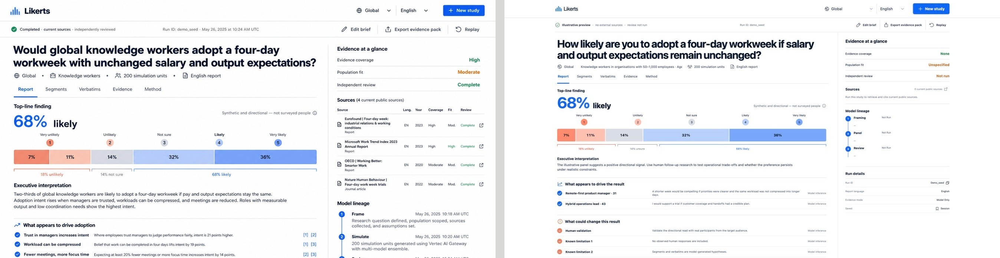

# Design QA — Evidence notebook report

## Comparison input

- Selected reference: `/Users/adi/.codex/generated_images/01a047f7-3221-7f51-8099-b3d5f58a0616/exec-09d754ee-a994-4cc0-9fbc-2c5a3ee56669.png` (1487 × 1058)
- Safari implementation capture: `design-qa-artifacts/implementation-local-safari.jpeg` (1336 × 768, including 70 px browser chrome)
- Normalized comparison: `design-qa-artifacts/reference-vs-implementation-pass1.jpeg` (reference left, implementation right; both compared at a 1336 × 698 top-of-page viewport)

## Findings and corrections

- Matched the reference's report-first hierarchy: slim global header, run status/action bar, large research question, scoped metadata, tabbed report, Likert distribution, interpretation rows, and a persistent evidence index.
- Corrected the desktop balance to a 2:1 report/evidence grid so the evidence index occupies roughly one third of the workspace, matching the selected reference.
- Preserved the reference's restrained white, navy, blue, coral, and neutral palette; compact typography; square-edged data surfaces; and light rule-based separation.
- Verified the editor open/close flow and Report/Evidence tab switching in Safari. Tabs now implement roving focus plus Arrow, Home, and End keyboard controls.
- Replaced drawn icons with the Phosphor icon library and replaced the CSS-built logo with the real Likerts logo asset.
- Corrected all review findings: no fabricated claim citations, no population-fit inference, no unsupported source-freshness claim, model review is not described as independent review, detailed evidence trace/risk remains visible, and concurrent paid model runs are guarded.
- Completed localized sample/report presentation across ten locales. Full interface localization is runtime-enabled only for `en-US`, `zh-CN`, `ja-JP`, and `ko-KR`; the other six remain output-enabled with planned UI support. RTL spacing and localized sample/report scale, evidence, methodology, and footer labels are covered without claiming a complete Arabic interface.
- Darkened caution text to meet normal-text contrast and retained the audience context on narrow screens.

## Severity audit

- P0: none
- P1: none
- P2: none
- P3: report content can wrap differently from the concept image because live study questions, citations, and model output vary in length.

## Final result

passed
