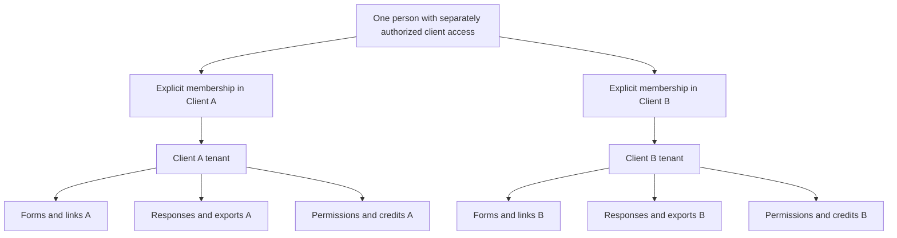
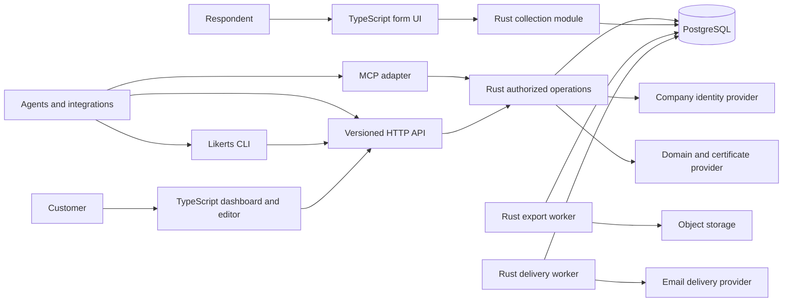
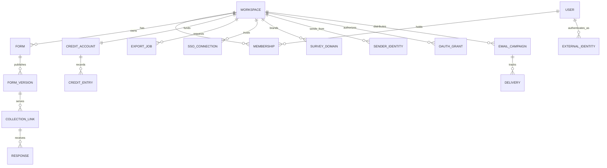
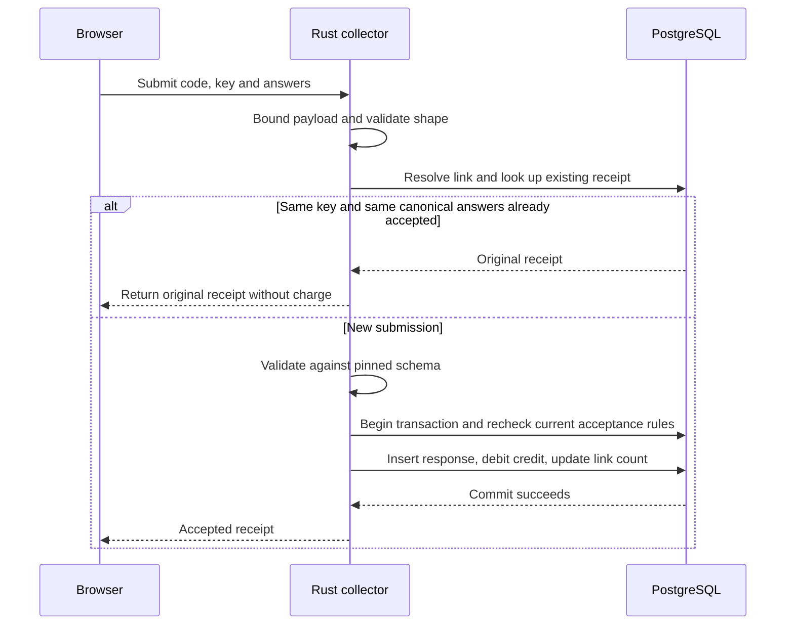

# Superseded dedicated-enterprise architecture

**Historical record only.** Dedicated hosting, branded respondent links and email distribution were superseded by the customer-controlled embedded service in [../MODEL.md](../MODEL.md). None of this document's architecture is a current launch commitment.

Historical status: proposed architecture. Stack decision: TypeScript and Rust. This document specifies behavior; it is not a running implementation or a validated cost model.

Confirmed direction: enterprise from day one; a dedicated deployment for every client from day one; branded survey URLs; verified customer email domains; no local username/password login; API-first with complete MCP and CLI capability coverage. SSO-only human login is the current recommendation under discussion. Direct passkeys were considered; passkeys at the customer identity provider remain compatible with SSO.

## Product

Likerts creates simple forms, distributes them through many tagged links, and collects consistent responses at low cost.

A customer creates one form, uploads a list of stores or campaigns, generates a branded short link and QR code for each row, optionally sends invitations from its verified email domain, then exports the responses together. Public respondents do not need accounts. The customer supplies the audience. Any later restricted respondent access is separate from workforce SSO and does not grant management access.

The core relationship is **one published form version → many collection links → many responses**. A link identifies a collection context, not a person. A public store link cannot prove physical presence or respondent uniqueness.

## Client isolation comes first

Confirmed user priority: keeping each client’s data and permissions isolated. A Workspace is the tenant boundary in this model; the UI may call it a client workspace. A person may have explicit memberships in several client deployments, but identities, sessions and grants are tenant-bound and every operation executes in exactly one authorized tenant context. Switching the displayed workspace is navigation, not authorization.



There is no automatic data access through agency ownership, a shared email domain, payment responsibility or possession of a form ID. An agency employee needs an explicit membership in each client they serve. A store is normally link metadata inside its client tenant, unless it actually requires an independent access boundary.

### Permissions

| Role | Form design and publishing | Read responses and export | Manage members and billing |
| --- | --- | --- | --- |
| Owner | Yes | Yes | Yes |
| Builder | Yes | No | No |
| Analyst | No | Yes | No |

Owners are trusted to grant access within their tenant. Form previews and builder screens never include real responses for builders. There are no implicit cross-client reports or cross-client exports in the first version. Membership removal blocks subsequent authorized requests and new downloads; already downloaded data cannot be revoked.

### Isolation enforcement

1. **Rust authorization:** authenticate the user, resolve the requested tenant and check current membership and the operation’s capability. Construct an AuthorizedTenant context through this check. Tenant-owned repositories require that context; they do not accept arbitrary tenant IDs from handlers. Every referenced object is checked in that tenant.
2. **Database boundary and policies:** provision a dedicated PostgreSQL instance or cluster for each client, with client-specific credentials and network access. Never place different clients in the same database instance. Retain tenant keys and row-level security for tenant-owned records as defense in depth. Apply read predicates and write checks, with default denial when context is missing. The runtime role is not a superuser, table owner or BYPASSRLS role. Migration credentials are separate. RLS supplements application checks; it does not independently authenticate a client-supplied tenant value.
3. **Connection safety:** set tenant context transaction-locally and run all related queries within that transaction. Pooled connections must never retain another request’s authorization context. Test failure, cancellation and reuse, not only successful requests.
4. **References:** composite foreign keys include workspace_id, preventing a response, link or export relationship from crossing tenants. Normalize database errors so foreign-key and uniqueness failures do not reveal another client’s private identifiers.
5. **Public collection:** the verified hostname routes to a fixed client deployment; that deployment resolves a random public link into a limited collection capability. Never select a database using a caller-supplied tenant ID. Reject mismatches between deployment identity, host, token and requested tenant. It exposes only the published public schema and acceptance state, never responses or tenant membership. Public handlers cannot invoke management repository operations merely because the lookup found a tenant.
6. **Derived data:** tenant identity follows cache keys, object storage keys, export selections, jobs and audit events. Storage paths alone are not authorization. Export execution and download authorization recheck membership; jobs cannot execute arbitrary caller-supplied SQL or object keys.

PostgreSQL documents owner/superuser bypass and policy behavior, so enabling RLS alone is not sufficient. Transaction-local settings provide the intended lifetime for pooled request context. Sources: [row security](https://www.postgresql.org/docs/current/ddl-rowsecurity.html), [SET LOCAL](https://www.postgresql.org/docs/current/sql-set.html).

Prefer an authenticated download gateway when immediate membership revocation must stop access to existing export links. If using signed object URLs, disclose that a URL remains usable until its short expiry; rechecking membership before issuance does not revoke an already issued URL. Platform support has no routine response access. Any necessary support elevation is time-limited, justified and audited.

### Dedicated deployment baseline

Every client receives the same versioned product deployed into its own cloud account/project security boundary, private network, application and worker services, PostgreSQL instance/cluster, object storage, encryption keys, secrets, queues/jobs, backups and audit storage. Runtime credentials cannot reach any other client environment. Cloud provider and exact resources remain implementation choices. Dedicated means customer-exclusive cloud resources and access boundaries; it does not promise exclusive physical servers.

A small shared provisioning control plane stores only the deployment directory, provisioning state, software versions and necessary commercial metadata. It does not store survey answers, recipients, exports or customer credentials. Route customer API/MCP/CLI traffic to the dedicated environment. Public platform-owned links use a tenant-specific hostname; vanity domains map to that same environment. No global response lookup is needed.

Provisioning automation is privileged and must be treated as a potential cross-client attack path: narrowly scoped per-deployment roles, short-lived credentials, approved signed releases, staged updates and audited access. Routine control-plane services have no customer-data read access. Customer SSO sessions and operational OAuth grants remain bound to their environment even if a shared discovery or identity service is used. Document shared dependencies such as DNS, CDN, identity, payment and email providers and their remaining outage risks.

One codebase and infrastructure template manage the fleet; no customer-specific forks. Onboarding creates the isolated environment in the agreed region, verifies network/IAM boundaries, configures SSO and verified domains, exercises backup/restore and isolation checks, then activates the deployment. Track provisioning and deletion as idempotent asynchronous jobs exposed through API, MCP and CLI. Deletion includes resource teardown, domain removal, credential revocation and the documented backup expiry process.

Set per-deployment resource limits, availability objectives and restore objectives. Usage is US$0.01 per accepted completed response. Confirmed commercial model: pay as you go, with no subscription, dedicated-environment base fee or minimum commitment. There is no shared-runtime economy tier in the initial product. Dedicated deployment is a confirmed architecture decision, not evidence of SOC 2 compliance or a guarantee of procurement approval.

### Required isolation tests

Create two independently provisioned client environments with similar forms and overlapping human users. Verify that each runtime identity cannot connect to the other environment’s database, storage, keys, secrets or backups. Swap API/MCP tokens, hostnames and CLI tenant selections; all mismatches must fail. Test provisioning-role restrictions, deployment routing, restore destinations and log isolation. Then attempt application-level boundary violations in both deployments. Attempt to read, edit, publish, export and delete the other tenant’s objects by changing IDs, URLs and request fields. Verify builder/analyst role separation, membership revocation, export-job authorization, cache separation and pooled-connection reuse after cancellation. Repeat checks with direct database queries under the runtime role and missing tenant context. A test suite must demonstrate the boundary before this model is described as implemented or secure.

## System boundary



The diagram describes one customer’s dedicated environment. Deploy an identical copy for each customer. Start with one Rust application organized into identity, tenant management, publishing, collection, domains, delivery, billing and export modules. Worker processes from the same codebase run exports and email delivery. PostgreSQL holds jobs; object storage holds finished files. API and MCP are adapters over the same authorized operations, not separately implemented products.

The browser downloads static assets through a CDN. Public form definitions can be cached because published versions are immutable. Management endpoints, private metadata and responses are never public cache entries. Link closure, expiry and quota checks happen again on submission, even when the browser loaded an older cached definition.

Rust owns authoritative validation. TypeScript provides immediate validation feedback and renders the supported question types. Versioned API contracts and shared fixtures keep their interpretations aligned. A renderer library, if adopted, is an adapter to our restricted schema rather than the owner of that schema.

## Complete API, MCP and CLI coverage

Every product capability has a versioned API operation, an MCP tool or resource representation and a CLI command from its first release. The dashboard is another client. There are no dashboard-only administration features or privileged MCP shortcuts. "All capabilities" means full coverage, not an unrestricted token or a bypass of client isolation.

Maintain a capability registry mapping operation ID, request/response schemas, scopes, tenant role requirements, idempotency behavior, audit event, MCP representation and CLI command. CI checks coverage so a new feature cannot silently omit its API, MCP or CLI surface. Use discoverable JSON schemas, cursor pagination, stable error codes, operation receipts and asynchronous job status. Tools may expose bounded bulk operations over the same underlying contracts.

### Operating the whole Likerts platform from Codex or Claude

The intended customer workflow is operating the entire Likerts platform from an agent client. This includes tenant provisioning, membership and permissions, SSO configuration, branded domains, sender verification, integrations and grants, billing and limits, audit inspection, templates, complete survey lifecycles, distribution, delivery, responses, exports and deletion. Every customer-facing platform capability is available through MCP and CLI; the dashboard is optional. This covers each customer's authorized platform administration, not access to other tenants or the provider's infrastructure credentials.

For example, a customer can ask an agent to provision a workspace, configure its SSO and branding, assign team roles, create and publish a survey, distribute metadata-bound links, inspect collection, export results and revoke an integration. The agent uses MCP directly or invokes the CLI in a shell-enabled environment. Neither path requires the dashboard. Respondents complete the hosted form; platform jobs and collection continue when the agent session ends. The language model is not in the response ingestion path and incurs no mandatory per-response inference cost.

Build a thin Rust CLI over the versioned HTTP API. Provide explicit tenant selection, JSON output, schema/help discovery, file/stdin input, stable exit codes, pagination and resumable job status. Interactive login opens the SSO/OAuth browser flow; credentials use the operating-system credential store. Automation uses scoped service credentials through a protected credential source, never command-line arguments. Noninteractive execution fails with a structured error when authentication or required input is missing. All mutations share the API's authorization, audit and idempotency rules. Support preview/dry-run where meaningful and explicit execution for external sends and destructive actions, without forcing repeated prompts after an action has already been explicitly authorized.

Illustrative command design (not implemented): `likerts forms create --tenant acme --file survey.json --json`, `likerts forms publish FORM_ID --tenant acme --json`, `likerts links import --tenant acme --version VERSION_ID --file branches.csv --json`, and `likerts exports create --tenant acme --form FORM_ID --format csv --json`. Every remaining capability family below also receives commands in the registry.

| Capability family | Representative MCP operations | OAuth scope examples |
| --- | --- | --- |
| Tenant lifecycle | create_tenant, list_tenants, get_tenant, update_tenant, delete_tenant, get_deletion_status | tenants:create, tenants:read, tenants:manage, tenants:delete |
| Membership and access | invite_member, list_members, set_member_role, revoke_member, list_sessions, revoke_session | members:read, members:manage, sessions:manage |
| SSO | create_sso_connection, get_sso_setup, test_sso_connection, activate_sso_connection, rotate_sso_certificate, disable_sso_connection | identity:read, identity:manage |
| Branded URLs | add_domain, get_dns_instructions, verify_domain, get_certificate_status, set_primary_domain, remove_domain | domains:read, domains:manage |
| Sender identities | add_sender_domain, get_sender_dns, verify_sender_domain, configure_sender, pause_sender | senders:read, senders:manage |
| Form lifecycle | create_form, get_form, update_draft, validate_form, preview_form, publish_form, list_versions, archive_form, delete_form | forms:read, forms:write, forms:publish, forms:delete |
| Templates | create_template, list_templates, get_template, instantiate_template, update_template, delete_template | templates:read, templates:write |
| Distribution | create_link_batch, list_links, get_link, update_link_state, create_qr_export, replace_link | links:read, links:write |
| Email campaigns | create_campaign, import_recipients, preview_message, send_campaign, get_delivery_status, cancel_campaign, manage_suppressions | campaigns:read, campaigns:write, campaigns:send |
| Responses | list_responses, get_response, submit_response, delete_response | responses:read, responses:submit, responses:delete |
| Exports | create_export, get_export_status, download_export, delete_export | exports:create, exports:read, exports:delete |
| Billing | get_balance, list_credit_entries, create_checkout, get_payment_status, configure_spending_limit | billing:read, billing:manage |
| Audit and integrations | list_audit_events, register_oauth_client, list_grants, revoke_grant, create_service_identity, revoke_service_identity | audit:read, integrations:manage |

This is a capability-family map, not the final complete endpoint list. Each concrete operation must enter the registry. Preview resources, CSV files and QR archives can be returned as authorized resources or downloads rather than huge tool text. A registered template is a tenant-owned reusable draft schema; copying a template between tenants requires explicit source and destination permissions and never copies responses.

SSO login, OAuth consent, payment authentication and domain ownership proof may involve external browser or DNS actions. MCP can initiate them, return actionable setup instructions and poll status; it cannot fabricate the user’s authentication, bank approval or domain control. Configuration itself remains fully available through MCP. Secrets should flow through protected credential handoffs or secret references, not routine model-visible tool results.

## Human login and integration authorization

Proposed first release: SSO for workforce login, no password database, password reset or local password fallback. Support enterprise OIDC and SAML connections through a maintained identity layer; the provider/library choice remains open. Avoid implementing SAML cryptography or an OAuth authorization server from scratch merely to keep the application in Rust.

The customer identity provider can use passkeys or its own MFA. That is compatible with SSO and does not require Likerts to enroll passkeys itself. Direct Likerts passkeys would add enrollment, recovery and tenant-policy enforcement; they are an optional later decision, not an SSO bypass. If implemented later, use a canonical authentication origin and explicitly configured relying-party IDs rather than assuming credentials work across unrelated vanity domains. [WebAuthn specification](https://www.w3.org/TR/webauthn-3/).

Resolve the tenant through an explicit organization identifier or verified domain, then redirect to its configured connection. Email can help discovery but is not an authorization proof. Bind external identities to their connection and stable provider subject, not email alone. Never auto-merge identities from different providers merely because the email matches. [OpenID Connect](https://openid.net/specs/openid-connect-core-1_0.html).

SSO establishes identity; Membership grants tenant access. Provision by explicit invitation or approved identity-provider group rules. Disable generic email-domain autojoin. First-owner setup is a controlled tenant-provisioning flow that verifies authority and tests the connection before activation. IdP outage handling uses the agreed enterprise recovery process, not an undocumented password fallback.

Separate SSO connections may be required when a user belongs to different clients. A session records authentication connection, time and policy version; switching tenants must satisfy the destination tenant’s policy. Removing membership revokes application access. Disabling a user at the IdP does not by itself guarantee immediate local-session revocation: enterprise lifecycle integration must provide deprovisioning events/SCIM or specify a bounded reauthentication interval and admin revocation path. Automated deprovisioning is an enterprise requirement to resolve before launch.

OAuth is still required for delegated API/MCP access even when humans use SSO. A user signs in through SSO and authorizes an integration for a tenant and a set of scopes. The token does not give the integration the user’s identity-provider credentials. Use short-lived access tokens, revocable grants, appropriate authorization-code/PKCE flows, audience validation and supported protected-resource discovery for remote MCP. Pin the implemented MCP specification and verify client interoperability. [MCP authorization specification](https://github.com/modelcontextprotocol/modelcontextprotocol/blob/main/docs/specification/2026-07-28/basic/authorization/index.mdx).

Effective permission is the intersection of tenant policy, current user/service role, granted scopes and resource ownership. A forms:write token cannot read responses, send mail, manage SSO or switch to an ungranted tenant. Scope names alone never grant a missing role. Use one tenant per operational grant by default; account-level tenant discovery/provisioning is a separate narrow grant. Any future portfolio grant must explicitly enumerate authorized tenants.

For unattended integrations, support tenant-owned service identities with an approved machine authentication flow and bounded scopes. These are not human username/password accounts. Revoking a service identity disables its grants. Incoming authenticated MCP tokens are verified for the MCP audience; an adapter invokes the shared operation layer directly rather than forwarding that token to an unrelated API audience.

## Tenant branding and outbound email

Enterprise tenant configuration includes BrandProfile, SurveyDomain and SenderIdentity from day one. The company can use a URL such as `https://feedback.customer.example/s/<code>` and an approved sender such as `surveys@customer.example`. Names here are examples, not registered domains.

SurveyDomain has pending, verified, active, suspended and removed states. Ownership proof, routing and certificate issuance must all succeed before activation. Normalize and uniquely bind hostnames to tenants. On every public request, the verified host and collection link must resolve to the same tenant; a Client A hostname must not serve a Client B link. Reassignment requires fresh verification. Preserve domain bindings in cache keys and use controlled teardown to avoid stale routing after deletion.

Branded survey URLs do not require hosting employee authentication on every customer domain. Use a canonical authentication host, tenant-aware SSO and an allowlisted return path. The respondent brand remains visible on the survey and email; staff-login custom domains can be added as a separately specified capability if required.

Email domains have their own verification state, independent of web domains. Configure verified From addresses and aligned DKIM/MAIL FROM as appropriate, with a DMARC-compatible setup. A Reply-To address is not equivalent to authenticated sending. The customer grants DNS or provider authorization; Likerts never impersonates an unverified domain. Sources: [custom MAIL FROM](https://docs.aws.amazon.com/ses/latest/dg/mail-from.html), [DMARC alignment](https://docs.aws.amazon.com/ses/latest/dg/send-email-authentication-dmarc.html). These sources describe one provider; provider selection is not yet committed.

Delivery jobs use only that tenant’s verified sender identities, templates and recipient lists. Persist recipient-level delivery status, provider message IDs, retries and suppression outcomes. Verify provider event authenticity and deduplicate events. Once a provider accepts a message, blind retries can duplicate delivery; reconcile ambiguous outcomes using provider capabilities rather than promising exactly-once email. Cancel stops unsent work, not mail already delivered.

Separate campaigns:send from draft editing so granting form or campaign authoring does not authorize contacting recipients. Outbound volume, bounces, complaints, applicable opt-outs and abuse controls are tenant-scoped. Use customer-specific email-provider accounts or isolated subaccounts and credentials with bounded permissions. Confirm the provider’s actual account isolation. Shared provider delivery networks and IP pools may still affect reputation and availability; dedicated sending IPs are a separate deliverability decision, not implied by a dedicated application. Per-email delivery costs and enterprise identity/domain overhead are separate from the proposed response-credit rate.

Audit identity-policy changes, membership changes, domain and sender activation, grant issuance/revocation, campaign sends, response exports/deletion and billing adjustments. Store actor, tenant, operation, OAuth client and request/job IDs without copying response contents or secrets into the audit log.

## Domain entities



| Entity | Essential fields | Rules |
| --- | --- | --- |
| User | id, state | Local identity record without a password; external identities hold provider subjects. |
| Workspace | id, name, status | Ownership, authorization and credit boundary. |
| Membership | workspace_id, user_id, role | Unique pair; owner, builder or analyst. Permission changes and billing require owner access. |
| Form | id, workspace_id, name, draft_schema, draft_revision, archived_at | Mutable draft; optimistic revision check prevents lost edits. Archiving does not delete responses. |
| FormVersion | id, workspace_id, form_id, version_number, schema, schema_hash, published_at | Immutable published snapshot. Unique version number within a form. |
| CollectionLink | id, workspace_id, form_version_id, public_code, label, metadata, state, expires_at, max_responses, accepted_count | Public code is random and unique. One link accepts many responses. Version and metadata are immutable. State and caps may change. |
| Response | id, workspace_id, collection_link_id, form_version_id, idempotency_key, request_hash, answers, metadata_snapshot, accepted_at | Accepted response content is immutable until explicit deletion. Unique link and idempotency key. |
| CreditAccount | workspace_id, available_credits | Integer response credits. Balance cannot become negative. |
| CreditEntry | id, workspace_id, kind, delta, response_id or payment_reference, created_at | Append-only audit record. Unique debit per response and unique credit per payment event. |
| ExportJob | id, workspace_id, requested_by, selection, state, object_key, expires_at, failure_code | Authorized selection is persisted. Background execution, bounded retries and expiring download access. |
| SSOConnection | id, workspace_id, protocol, issuer/entity_id, config_reference, state, policy_version | Tested and explicitly activated; secrets remain in protected storage. |
| ExternalIdentity | id, user_id, connection_id, issuer, subject | Stable provider binding; matching email does not merge identities. |
| SurveyDomain | id, workspace_id, hostname, verification_state, certificate_state | Verified unique hostname; link tenant must match hostname tenant. |
| SenderIdentity | id, workspace_id, domain, allowed_from, provider_reference, verification_state | Separate from survey-domain verification; only verified senders can send. |
| BrandProfile | workspace_id, name, logo_reference, theme | Validated presentation settings; no executable markup. |
| OAuthGrant | id, workspace_id, subject_id, client_id, scopes, state, expiry | Tenant-bound authority intersected with current role and policy. |
| Template | id, workspace_id, name, draft_schema, revision | Reusable question definition; no responses or recipient data. |
| EmailCampaign | id, workspace_id, sender_id, template, state, requested_by | Drafting and sending are distinct permissions. |
| Delivery | id, workspace_id, campaign_id, recipient_reference, provider_id, state | Tenant-bound recipient data; retries and provider events deduplicated. |
| AuditEvent | id, workspace_id, actor_id, client_id, operation, target_id, timestamp | Append-only access-controlled record; no secrets or raw answers. |

Every tenant-owned relation includes workspace_id. Composite foreign keys prevent a link in one workspace referencing another workspace’s form, and prevent a response referencing a different version from its link. Rust authorization and PostgreSQL row-level policies are required defense-in-depth controls within each dedicated database, with the role and connection-pooling constraints described above.

Do not create a separate SQL table for each form. Within each client database, use one response table across that client’s forms with structured JSON answers, indexed primarily by workspace, form version, collection link and acceptance time. Add answer-specific indexes only when a demonstrated query requires them. Indexing every metadata key or answer would increase storage and write costs.

## Published form format

Start with six types: single choice, multiple choice, integer rating scale, bounded text, number and date. The editor exposes only supported settings. No uploads, arbitrary HTML, custom JavaScript or expression language in the initial contract.

Example of a published schema:

```json
{
  "schemaVersion": 1,
  "title": "Store visit feedback",
  "questions": [
    {
      "id": "q_experience",
      "type": "scale",
      "label": "How was your visit?",
      "required": true,
      "min": 1,
      "max": 5,
      "labels": {"1": "Very poor", "5": "Excellent"}
    },
    {
      "id": "q_reason",
      "type": "single_choice",
      "label": "What most influenced your answer?",
      "required": false,
      "options": [
        {"id": "opt_service", "label": "Service"},
        {"id": "opt_wait", "label": "Waiting time"}
      ]
    },
    {
      "id": "q_comment",
      "type": "text",
      "label": "Anything else?",
      "required": false,
      "maxLength": 500
    }
  ]
}
```

Question and option IDs are distinct from labels. Keep IDs when fixing wording without changing meaning; assign new IDs for changed meanings or types. Validate requiredness, allowed IDs, ranges, dates, duplicate choices and lengths on the server. Optional unanswered questions are omitted, not represented by ambiguous empty strings. Date answers use a calendar date without a timezone. General numbers need explicit precision/range limits; this is not a monetary-calculation engine.

Publishing validates and freezes the draft into a new FormVersion. Existing links continue serving their pinned version. New versions do not silently change running collections or historical responses.

## Metadata and short links

A bulk import might contain:

```csv
label,store_id,region,campaign
Orchard,SG001,central,visit_sep
Tampines,SG002,east,visit_sep
```

For each valid row, Likerts creates a CollectionLink pointing to the same FormVersion. A short URL such as `https://<our-domain>/s/<random-code>` resolves that link. Its QR code encodes exactly that URL. Bulk creation uses an idempotent batch request and returns row-level outcomes; retrying a batch must not create duplicate links.

Authoritative metadata lives on the server, behind the code. It is copied into the response at acceptance. Public form payloads do not expose private metadata. Any future public display fields or respondent-supplied URL fields must be explicitly distinguished from trusted metadata.

The code uses at least 96 random bits, for example 16 base64url characters. Short means usable, not sequential or guessable. It is a public collection capability, never an administrative credential. Changing a link’s bound metadata or version creates a replacement link and QR code; silently retargeting printed QR codes is outside the initial model.

## Submission protocol

The public request contains answers and a client-generated idempotency key. The browser creates the key for one submission attempt and reuses it on retry. Tenant, version and metadata are resolved by the server, not trusted from the request.

```json
{
  "idempotencyKey": "example-client-generated-uuid",
  "answers": {
    "q_experience": 4,
    "q_reason": "opt_service",
    "q_comment": "Helpful staff"
  }
}
```



Return success only after the response and debit commit together. The transaction rechecks link status, expiry, cap and available credits. A unique constraint resolves simultaneous retries; the losing transaction rolls back all changes and returns the existing receipt. Reusing a key with different canonical answers returns a conflict. Use a documented lock order for link/account updates to avoid inconsistent transaction behavior.

An already accepted retry returns its receipt even if the link subsequently closed or credits ran out. It must not accept new data. Persist a minimal deduplication receipt for the documented retry window if response contents are deleted earlier. Do not store raw answers in logs or receipt records.

A lost HTTP response after commit is recoverable by retry. A database error produces no acceptance acknowledgement. An idempotency key prevents duplicate transport retries; it does not identify duplicate humans or stop a bot creating fresh keys.

## Collection API outline

These endpoints illustrate the collection subset. Enterprise and management coverage is governed by the complete capability registry above, with matching MCP exposure.

| Boundary | Endpoint | Behavior |
| --- | --- | --- |
| Management | POST /v1/workspaces/{workspaceId}/forms | Create draft within authorized workspace. |
| Management | PATCH /v1/workspaces/{workspaceId}/forms/{id}/draft | Update draft with expected revision. |
| Management | POST /v1/workspaces/{workspaceId}/forms/{id}/versions | Publish once using an idempotency key. |
| Management | POST /v1/workspaces/{workspaceId}/collection-links/batches | Create many links from validated rows. |
| Management | PATCH /v1/workspaces/{workspaceId}/collection-links/{id} | Pause, close or adjust expiry/cap. |
| Management | GET /v1/workspaces/{workspaceId}/responses | Cursor-paginated, tenant-scoped result list. |
| Management | POST /v1/workspaces/{workspaceId}/exports | Persist authorized export selection and return job ID. |
| Management | GET /v1/workspaces/{workspaceId}/exports/{id} | Status and authorized download access. |
| Public | GET /s/{code} | Load respondent UI and public form definition. |
| Public | POST /v1/public/links/{code}/responses | Validate and durably accept one completed response. |
| Internal billing | POST /v1/payment-events | Verify provider authenticity and credit each payment once. |

Use a consistent error envelope with a machine-readable code, optional question errors and a request ID. Distinguish invalid answers, closed collection, key conflict, quota exhaustion and transient overload. Do not reveal balances or tenant details through public errors. Rate-limit public routes and cap work before expensive parsing or database activity.

## Credits and economics

One accepted completed submission costs one response credit. At the confirmed rate of US$0.01 per response, one US dollar purchases 100 credits. This replaces the earlier $1 per 100,000 responses target. Thus 10,000 responses cost $100, 100,000 cost $1,000 and 1,000,000 cost $10,000 in response usage. Payments use integer currency minor units; response accounting uses integer credits, avoiding fractional-cent rounding per response.

In one database transaction, insert the response, insert its unique debit entry and decrement the account if its balance is positive. Invalid submissions and identical retries are not charged. Refunds are explicit compensating ledger entries; deleting a response does not automatically refund a credit. Payment reversals and chargebacks require explicit account handling rather than silently producing a negative response balance.

The client’s single credit-account row can become a hot-tenant bottleneck. Measure it. Only introduce reserved credit blocks or partitioned counters when necessary, with explicit crash recovery and reconciliation rules. The same caution applies to exact per-link caps.

No budget should depend on language choice alone. Record total cost per accepted unique submission, payload bytes, database write amplification, retention, visits per completion, exports and abuse traffic. The confirmed selling price is US$0.01 per accepted completed response; profitability remains to be validated against dedicated infrastructure and enterprise operating costs. The confirmed model is pay as you go, with no subscription, dedicated-environment base fee or minimum commitment. Dedicated capacity for idle and low-volume customers must be included in the viability model; do not assume a minimum charge to make the economics work. Retention duration, export allowances and maximum form/payload size are product decisions still to set. Prepaid versus metered postpaid settlement remains an implementation/commercial choice; the credit ledger is a proposed accounting mechanism, not a confirmed mandatory prepaid purchase.

## Exports and lifecycle

An export identifies workspace, forms/versions, link filters and a consistent database snapshot of accepted responses. The worker must define snapshot semantics explicitly; a wall-clock timestamp alone does not resolve transactions that commit late. For the first implementation, use a consistent database read transaction for a bounded export and monitor its effect on the database.

CSV contains response ID, acceptance time, form version, collection label, metadata columns and stable question IDs. Export labels alongside IDs through a schema manifest or explicit labeled columns. Never merge incompatible answer types across versions silently. Escape spreadsheet formula-like values in spreadsheet-oriented CSV output while preserving canonical stored answers.

Finished files expire independently of response retention. Before execution and download access, recheck the user’s current workspace membership and response-reading capability. Follow the authenticated-download versus signed-URL revocation policy above. Jobs record progress and failures and can be retried without duplicating billing. A workspace deletion process covers database rows, exported objects and the documented backup lifecycle.

## First implementation boundary

Build automated dedicated client provisioning and lifecycle management, SSO and scoped OAuth, complete API/MCP/CLI coverage, domain/sender verification, six question types, publication, bulk metadata links, invitation delivery, durable credit-backed submissions and CSV export. Keep the Rust application modular, with bounded database pools and bounded worker concurrency. Reject or throttle overload instead of accumulating unbounded in-memory work.

Prove the model with one form, 2,000 links and 100,000 responses, including duplicate retries, malformed answers, exhausted credits, simultaneous closure, database failure and concurrent exports. Verify no cross-workspace access, no acknowledged data loss, no double debit and reproducible exports. Exercise the agreed peak traffic separately from total monthly volume.

Later options include offline collection, branching, direct Likerts passkeys, specialized integration connectors and separate collector deployments. Each must preserve the published schema, tenant policy and submission contract. Reuse of LimeSurvey behavior is reference material; this model does not promise LimeSurvey-compatible imports, expressions or storage.

## Economics validation

See [economics/ECONOMICS.md](economics/ECONOMICS.md) for the 6 September 2026 scenario model of the proposed $5 one-time provisioning fee and confirmed $0.01 pay-as-you-go response price. The setup fee is under evaluation. Dedicated infrastructure, no subscription and no minimum commitment remain the intended product direction; financial viability at low usage is unproven. Suspension savings are not assumed, and any sleeping design must preserve durable collection and the dedicated boundary.
